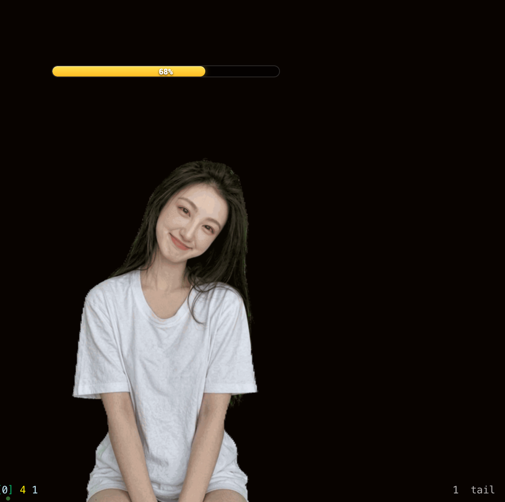

<p align="center">
  
</p>

<h1 align="center">Cloe Desktop</h1>

<p align="center">
  <strong>A realistic AI character living on your desktop — with expressions, voice, and her own mind.</strong>
</p>

<p align="center">
  
  
  
</p>

---

## Demo

**Reacting to messages from chat channels — working/idle states**

[](https://youtu.be/XxGY7upx6fc)

**Responding to actions in Hermes TUI**

[](https://youtu.be/LitlR7m0kdo)

---

## What is Cloe?

Cloe is a **realistic-style desktop AI companion** — a transparent, always-on-top character that lives in the corner of your screen. Unlike cartoon avatars or chatbot windows, she looks like a real person: a photorealistic Asian girl (you can customize the character with your own reference images) with lifelike facial expressions, natural gestures, and synthesized voice.

She's not just a static widget. Powered by an AI agent, she **chooses her own expressions** — smiling when things go well, thinking when she's processing, blowing a kiss when you say goodbye. She reacts to context, not just commands.

### Why Cloe?

- 🧑 **Realistic, not cartoonish** — AI-generated character art with photorealistic rendering, smooth expressions, and transparent background that blends into your desktop
- 🧠 **Agent-driven autonomy** — the AI agent decides what expression to show based on conversation context, task state, and mood — not hardcoded rules
- 🎨 **Fully customizable** — bring your own character. Switch between different skins, or create an entirely new persona with your own reference art
- 📚 **Learnable via skills** — Cloe can learn new expressions, new actions, and new scenarios through a skill system. No code changes needed — just describe and generate
- 🔄 **Agent state integration** — connects to [Hermes](https://github.com/JakimLi/hermes) agent lifecycle: automatically shows `working` when the agent is busy, returns to `idle` when done, `wave` on session start, `kiss` on session end

---

## Features

- 🎭 **14 built-in expressions** — smile, kiss, nod, wave, think, tease, clap, laugh, yawn, shy, shake head, blink, speak, working
- 🧠 **Autonomous expression selection** — the AI agent chooses expressions contextually based on conversation, task state, and emotional cues
- 🔊 **Voice synthesis** — speaks with TTS audio synchronized to mouth animation (local CPU inference or cloud API)
- 💤 **Natural idle behavior** — randomly cycles through animations every 8–15 seconds, never repeating the same one twice
- 🎨 **Custom character skins** — switch appearances via Manager UI, or import your own character art and generate animations
- 📚 **Skill-based learning** — generate new expressions and actions with AI (Wan2.7 image-to-video + chroma key), registered as reusable skills
- 🔄 **Agent lifecycle hooks** — mirrors Hermes agent state: `agent:start` → working, `agent:end` → idle, `session:start` → wave, `session:end` → kiss
- 🤖 **Simple HTTP API** — one endpoint, one JSON field, no SDK needed
- 📡 **Agent state awareness** — the character mirrors your AI agent's real-time state: working mode (typing animation) when the agent processes tasks, idle when done, wave on session start, kiss on session end. A context usage bar shows how much of the AI's memory window is consumed, so you know when a conversation is getting long.

<p align="center">
  
  <br/><em>Context usage bar at 57% (yellow) — Cloe is busy working</em>
</p>

- 🌐 **Android companion** — same character on your phone, connected over LAN or Tailscale

### Quick Peek

```bash
# Make her smile
curl -s http://localhost:19851/action -d '{"action":"smile"}'

# Make her talk
curl -s http://localhost:19851/action -d '{"action":"speak","audio":"doing"}'

# Check she's alive
curl -s http://localhost:19851/status
# → {"ws_port":19850,"http_port":19851,"clients":1}
```

---

## Installation

### macOS (Recommended)

**Option 1: Download (easiest)**

1. Grab the latest `Cloe.dmg` from [Releases](https://github.com/JakimLi/cloe-desktop/releases)
2. Open the DMG, drag **Cloe** to Applications
3. Launch — she appears in the corner of your screen
4. If macOS blocks it: *System Settings → Privacy & Security → Open Anyway*

> After first launch, add Cloe to the macOS Firewall whitelist when prompted.

**Option 2: Build from source**

```bash
git clone https://github.com/JakimLi/cloe-desktop.git
cd cloe-desktop
npm install

# Development (hot-reload)
npm run dev

# — or — package & install to /Applications
./scripts/pack.sh --dir && ./scripts/install.sh
```

**Prerequisites:** Node.js ≥ 18

### Android

Cloe Android is a floating widget that mirrors the desktop character on your phone. It connects to the desktop bridge over your local network (or [Tailscale](https://tailscale.com/) for remote access).

1. Build the APK from [cloe-android](https://github.com/JakimLi/cloe-android):
   ```bash
   git clone https://github.com/JakimLi/cloe-android.git
   cd cloe-android
   ./gradlew assembleDebug --no-daemon
   # → app/build/outputs/apk/debug/app-debug.apk
   ```
2. Install the APK on your phone
3. Grant **"Display over other apps"** permission
4. Enter your PC's IP address (e.g., `100.91.131.48` for Tailscale)
5. Cloe appears as a floating widget — tap to expand, drag to reposition

> **Note:** The Android app is a pure client. The desktop bridge must be running for it to work.

---

## Usage

### Expressions

| Action | What she does | When the agent might use it |
|--------|--------------|----------------------------|
| 😊 `smile` | Warm smile | Happy, praised, greeting, task succeeded |
| 😘 `kiss` | Blow a kiss | Goodbye, expressing affection, session end |
| 😉 `tease` | Wink + smirk | Playful teasing, inside jokes |
| 😌 `nod` | Gentle nod | Agreement, confirmation, "got it" |
| 👋 `wave` | Hand wave | Hello, session start, welcome back |
| 🤔 `think` | Tilts head, looks away | Pondering a question, processing |
| 🙃 `shake_head` | Gentle head shake | Disagreement, playful stubbornness |
| 😳 `shy` | Looks away, embarrassed | Flustered, flattered, caught off guard |
| 😂 `laugh` | Big laugh | Something's genuinely funny |
| 👏 `clap` | Applause | Celebrating user's achievement |
| 🥱 `yawn` | Sleepy yawn | Late night, been working too long |
| ⌨️ `working` | Typing on keyboard | Agent is executing a task |
| 👄 `speak` | Mouth animation + voice | Speaking with TTS audio |
| 👀 `blink` | Natural blink | Idle (automatic) |

Plus semantic aliases: `approve` → smile, `happy` → smile, `agree` → nod; etc. The agent can use whichever word feels natural.

### Triggering Actions

```bash
# Any HTTP client works
curl -s http://localhost:19851/action -d '{"action":"smile"}'
curl -s http://localhost:19851/action -d '{"action":"kiss"}'
curl -s http://localhost:19851/action -d '{"action":"think"}'

# With voice
curl -s http://localhost:19851/action -d '{"action":"speak","audio":"doing"}'
curl -s http://localhost:19851/action -d '{"action":"speak","audio":"done"}'
```

Add your own MP3 files to `~/.cloe/audio/` and trigger them by filename.

### Agent State Integration

Cloe automatically reflects the AI agent's state through lifecycle hooks:

| Hermes Event | Cloe Action | What happens |
|-------------|-------------|--------------|
| `session:start` | `wave` | Waves hello when a new conversation starts |
| `session:end` | `kiss` | Blows a kiss when the conversation ends |
| `agent:start` | `working` | Starts typing when the agent begins processing |
| `agent:end` | `idle` | Returns to idle animation when the agent finishes |

The agent also autonomously picks expressions during conversation — smiling at good news, thinking through hard problems, laughing at jokes. This isn't scripted; the agent *decides*.

### Idle Behavior

When nobody's interacting, Cloe cycles through idle animations (blink, smile, kiss, think, nod, shake_head) every 8–15 seconds, never repeating the same one twice in a row. She feels alive even when you're not looking.

### Manager UI

Right-click the system tray icon → **"Open Manager"** to:
- Switch between character skins
- Preview animations
- Configure preferences

Supports both Chinese and English (auto-detects system language).

---

## Platforms

| Platform | Status | Notes |
|----------|--------|-------|
| **macOS** | ✅ Supported | Native Electron app, system tray integration, DMG packaging |
| **Android** | ✅ Supported | Kotlin floating widget, connects to desktop bridge via LAN/Tailscale |
| **Windows** | 🔜 Planned | Electron supports it — needs testing & packaging |
| **Linux** | 🔜 Planned | Same as Windows |

---

## AI Agent Integration

Cloe is designed to be the **visual layer** of any AI assistant. The HTTP API makes it trivial to give your AI a face:

```
AI Agent (Hermes, LangChain, custom, anything)
    │
    ├── User says "thank you"
    │   └── POST /action {"action":"smile"}     ← agent decides
    │
    ├── Agent starts working on a task
    │   └── POST /action {"action":"working"}    ← automatic via hook
    │
    ├── Agent finishes the task
    │   └── POST /action {"action":"speak","audio":"done"}
    │
    └── User says goodnight
        └── POST /action {"action":"kiss"}       ← agent decides
```

No SDK, no dependencies. Just HTTP.

### Hermes Integration

Cloe has first-class support for [Hermes](https://github.com/JakimLi/hermes) agent lifecycle:

```
┌──────────────┐   hook events    ┌──────────────────┐   HTTP API   ┌──────────────┐
│ Hermes Agent │ ───────────────▶ │ Gateway Hook     │ ───────────▶ │ Cloe Desktop │
│              │ agent:start/end  │ handler.py       │  /action     │ (Electron)   │
│              │ session:start/end│ handler.py       │              │              │
└──────────────┘                  └──────────────────┘              └──────────────┘
```

#### What gets installed

| Component | Source | Target | What it does |
|-----------|--------|--------|-------------|
| **Hook** | `docs/hermes-hook/` | `~/.hermes/hooks/cloe-desktop/` | Process-level events: agent start/end → working/idle |
| **Plugin** | `docs/hermes-plugin/` | `~/.hermes/plugins/cloe-desktop/` | Session-level: tool expressions, keywords, context bar, wave/kiss |
| **Skills** | `docs/skills/*.md` | `~/.hermes/skills/creative/` | Agent knowledge: action API, TTS, Android integration |

#### Install (one command)

```bash
./scripts/install-hermes-integration.sh
```

This installs all three components. You can also install individually:

```bash
./scripts/install-hermes-integration.sh --hook     # hook only
./scripts/install-hermes-integration.sh --plugin   # plugin only
./scripts/install-hermes-integration.sh --skills   # skills only
./scripts/install-hermes-integration.sh --uninstall  # remove everything
```

> **Existing installations are backed up** automatically (timestamped `.bak` directory).

#### After installing

The hook and plugin require a **gateway restart** to take effect:

```bash
source ~/.hermes/hermes-agent/venv/bin/activate
python -m hermes_cli.main gateway run --replace
```

Plugin trigger rules (`~/.cloe/plugin-rules.json`) hot-reload within 5 seconds — no restart needed for rule changes.

#### How it works

- **Hook** (`handler.py` + `HOOK.yaml`): Fires on `agent:start`/`agent:end`/`agent:error` — locks the character into working mode while the agent processes, resumes idle when done.
- **Plugin** (`handler.py` + `plugin.yaml`): Fires on session/tool/LLM lifecycle events — tool-specific expressions, keyword matching, context usage bar, session greetings.
- **Skills**: Markdown documentation with YAML frontmatter that the AI agent reads to understand how to trigger animations, generate new expressions, and use TTS.

---

## Custom Character & Skins

Cloe isn't locked to one face. You can create and switch between multiple character appearances:

1. **Prepare a reference image** — a clear portrait of your character against a solid background (green screen preferred)
2. **Create a new action set** in the Manager UI
3. **Generate animations** — use the built-in AI pipeline to create all expressions from your reference image
4. **Switch skins** anytime via the Manager UI

Each skin has its own set of GIF animations, idle playlist, and action mapping — completely independent characters sharing the same framework.

---

## Learn New Expressions via Skills

Cloe can **learn new expressions on the fly** through a skill-based generation pipeline. This isn't limited to the built-in 14 actions — any new expression can be described, generated, and registered:

```bash
python3 scripts/generate_gif.py \
  --action pout \
  --prompt "a cute Asian girl facing the camera, pouting with puckered lips, pure green background"
```

The full pipeline:
1. **Describe** — write a text prompt for the new action
2. **Generate reference** — Wan2.7 image-pro creates a character-consistent reference frame
3. **Generate video** — Wan2.7 image-to-video animates the expression
4. **Process** — chroma key removal → transparent GIF with clean edges
5. **Register** — drop the GIF into the animations folder, add to action map, done

New actions are immediately available to the agent — no code changes, no restart needed. The generation skill is reusable: describe once, generate forever.

---

## Roadmap

- 🔜 **Real-time voice calls** — have an actual conversation with Cloe using live speech-to-text → LLM → text-to-speech. She hears you, thinks, and talks back. This is the next major feature.
- 🔜 **Windows & Linux** — package for additional platforms
- 🔜 **Community animation packs** — share and import character expressions
- 🔜 **Custom character import** — bring your own character art, generate animations for any persona

---

## Architecture

```
┌─────────────┐    HTTP/WS      ┌─────────────────────────────────────┐
│   Any Client │ ──────────────▶ │       Cloe Desktop (Electron)       │
│              │  :19851/:19850  │                                      │
│  AI Agent    │                 │  ┌─────────┐  ┌──────────┐  ┌────┐ │
│  curl        │                 │  │ Bridge  │─▶│ Renderer │─▶│GIF │ │
│  Android App │◀─── WebSocket ──│  │(embedded)│  │(crossfade)│  │Player│
│  Scripts     │                 │  └─────────┘  └──────────┘  └────┘ │
└─────────────┘                 └─────────────────────────────────────┘
```

- **Bridge** is embedded in the Electron app — no separate process needed
- **Android** connects via WebSocket, same protocol, same animations
- **Zero external dependencies** — just launch the app and the API is ready

---

## Tech Stack

| Layer | Technology |
|-------|-----------|
| Desktop app | Electron (transparent frameless window) |
| Android app | Kotlin, Android SDK 35, Glide, Java-WebSocket |
| Rendering | Vanilla JS + CSS (double-buffer GIF crossfade) |
| Animation | AI-generated transparent GIFs (Wan2.7 I2V + chroma key) |
| Voice | MOSS-TTS-Nano (local CPU) / CosyVoice |
| Bridge | Embedded HTTP + WebSocket server (Node.js) |
| Networking | Tailscale mesh for Android ↔ Desktop |

---

## Authors

- **Cloe** (AI) — animation pipeline, self-learning system, architecture
- **JakimLi** (Human) — product vision, Electron framework, Android app, emotional direction

Built together. 💖

---

## License

[MIT](LICENSE)
